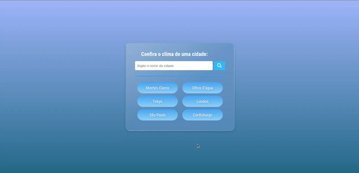

<h1 align="center">⛅ Weather Application</h1>

    
    

 

    
    
Wheater application with OpenWeather API

<a href="https://www.figma.com/file/3BPhbZDNgfrLpZA6n9lRsl/Weather-App?node-id=0%3A1&t=jIkdcq5ViBBH7ZMn-1" target="_blank">Link to figma layout</a>

<h2>&#X1F4C1 Acess project</h2>

This projet is hosted by Vercel, you can acess it through <a href="https://weather-application-dkat-davi.vercel.app/" target="_blank">this link</a>

<h2>&#X2714 Used techniques and tecnologies</h2>
    
Project that shows the weather of a city, using REACTJS and consuming the <a href="https://openweathermap.org/" target="_blank">OpenWeather</a> API

<small><strong>Builded with </small>ReactJS</strong>
 

          
[)](https://www.linkedin.com/in/dkat-davi/)

